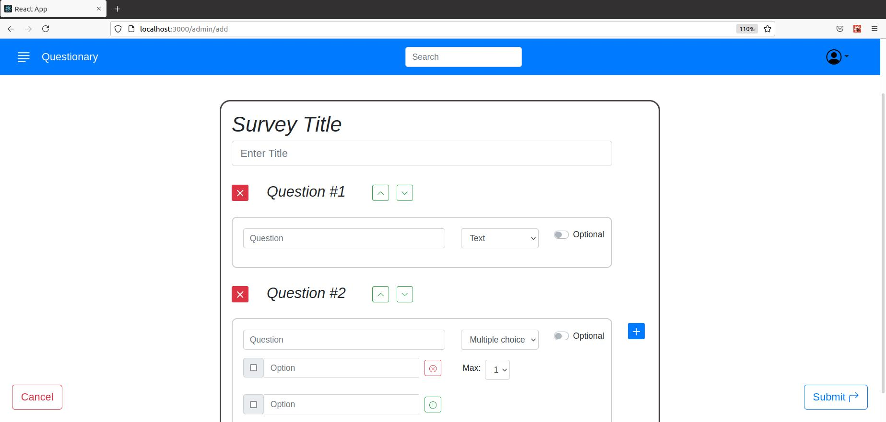

# Exam #1: "Questionario"
## Student: s280127 SOLAVAGIONE ALBERTO 

## React Client Application Routes

- Route `/`: 
  - *Page content*: has no content.
  - *Purpose*: used as a default route that redirect to `/surveys` if the client is not logged in or to `/admin/surveys` if the client is logged.
- Route `/login`:
  - *Page content*: login page.
  - *Purpose*: can insert username and password to login in the application.
- Route `/surveys`: 
  - *Page content*: this route contains the page for the non logged users where all the surveys are listed.
  - *Purpose*: the user can choose a survey to answer.
- Route `/surveys/compile`:
  - *Page content*: compilation page for a survey.
  - *Purpose*: in this page the user can answer to the survey that has selected from the table.
- Route `/admin/surveys`:
  - *Page content*: this route contains the page for the logged users (admins) where are listed all the surveys that the current admin has created.
  - *Purpose*: this page offers the possibility to create a new survey or visualize the answers that the users gave to the survey created before.
- Route `/admin/add`:
  - *Page content*: this route contains the survey creation page.
  - *Purpose*: in this page an admin can create and customize a new survey. He can choose a title for the survey, add or remove a question, choose the type of question, insert a question title, add or remove choices for the multiple choice questions or switch the questions order.
- Route `/admin/surveys/:idS/answers`:
  - *Page content*: this page contains the answers given by the users to a particular survey and you can switch from the answers of a user to the answers of another.
  - *Purpose*: the admin can inspect the responses that a survey has received. 
  - *Param* `:idS`: id of the selected survey.

## API Server

- POST `/api/sessions`
  - **Description:** for performing the login
  - **Request parameters:** *None*
  - **Request body content:**
    * *Content-Type:* `application/json`
        ````
        {
          "username":"admin1@polito.it",
          "password":"password1"
        }
        ````
  - **Success Response:**
    *  *Code:* `200 OK`
    *  *Content:*
          ````
          {"id":1,"username":"admin1@polito.it","name":"Bob"}
          ````
  - **Error Response:**
    *  *Code:* `401 Unauthorized`
    *  *Content:* 
          ```
          {"message":"Username or password wrong"}
          ````
          
- GET `/api/sessions/current`
  - **Description:** to retrieve the current session if exist
  - **Request parameters:** Session cookie
  - **Request body content:** *None*
  - **Success Response:**
    *  *Code:* `200 OK`
    *  *Content:*
          ````
          {"id":1,"username":"admin1@polito.it","name":"Bob"}
          ````
  - **Error Response:**
    *  *Code:* `401 Unauthorized`
    *  *Content:* 
          ```
          {"message":"Username or password wrong"}
          ````

- DELETE `/api/sessions/current`
  - **Description:** to perform the logout
  - **Request parameters:** Session cookie
  - **Request body content:** *None*
  - **Success Response:**
    *  *Code:* `200 OK`
    *  *Content*: *None*
  - **Error Response:**
    *  *Code:* `401 Unauthorized`
    *  *Content:* 
          ```
          {"message":"Username or password wrong"}
          ````

- GET `/api/surveys`
  - **Description:** to retrieve all the surveys (for non logged in users)
  - **Request parameters:** *None*
  - **Request body content:** *None*
  - **Success Response:**
    *  *Code:* `200 OK`
    *  *Content*: Surveys array with all the informations about them
  - **Error Response:**
    *  *Code:* `503 Service Unavailable`
    *  *Content:* 
          ```
          { error: 'Database error during the retrievement of the surveys.' }
          ````

- GET `/api/admin/surveys`
  - **Description:** to retrieve the surveys that the current logged admin has created
  - **Request parameters:** *None*
  - **Request body content:** *None*
  - **Success Response:**
    *  *Code:* `200 Ok`
    *  *Content*: Surveys array with all the informations abount them
  - **Error Response:**
    *  *Code:* `503 Service Unavailable`
    *  *Content:* 
          ```
          { error: 'Database error during the retrievement of the surveys.' }
          ````

- POST `/api/surveys`
  - **Description:** to create a new the survey and save it to the database
  - **Request parameters:** *None*
  - **Request body content:** The informations about the created survey
  - **Success Response:**
    *  *Code:* `201 Created`
    *  *Content*:
          ````
          { id: *created_survey_id* }
          ````
  - **Error Response:**
    *  *Code:* `503 Service Unavailable`
    *  *Content:* 
          ```
          { error: 'Database error during the creation of the survey.' }
          ````

- POST `/api/answers`
  - **Description:** to save a new answer to a survey into the database
  - **Request parameters:** *None*
  - **Request body content:** The informations about the answer
  - **Success Response:**
    *  *Code:* `201 Created`
    *  *Content*:
          ````
          { id: *created_answer_id* }
          ````
  - **Error Response:**
    *  *Code:* `503 Service Unavailable`
    *  *Content:* 
          ```
          { error: 'Database error while saving the answer.' }
          ````

- GET `/api/answers`
  - **Description:** to retrieve all the answers to survey
  - **Request parameters:** *None*
  - **Request body content:** The informations abount the answers
  - **Success Response:**
    *  *Code:* `200 Ok`
    *  *Content*: answers array with all the informations about every answer
  - **Error Response:**
    *  *Code:* `503 Service Unavailable`
    *  *Content:* 
          ```
          { error: 'Database error during the retrievement of the answers.' }
          ````
    

## Database Tables

- Table `admins` - contains *`id, email, name, hash`*
    > This table contains all the informations of the admins of the application, including the bcrypted password.
- Table `surveys` - contains *`id, title, admin`*
    > This table contains the informations of all the created surveys.
- Table `questions` - contains *`id, title, type, idS, min, max`*
    > This table contains the informations of all the created questions for every survey, including the type (0 = open question, 1 = multiple choice question) of question and the constraints (min, max).
- Table `choices` - contains *`id, title, idQ`*
    > This table contains the informations of all the different choices for all the multiple choice questions (type = 1).
- Table `answers` - contains *`id, name, idS`*
    > This table contains the list of all the answers for every survey with the name of the person that has compiled that survey.
- Table `data_answers` -  contains *`id, data, idQ, idA`*
    > This table contains the informations for every answer to every question like the text that the client wrote in the open questions or, for the multiple choice questions, a string that is the concatenation of the IDs of the choices that the client has selected.
 

## Main React Components
- `App` (in `App.js`): this is the principal component that contains all the routes for the other components. Here there are the useEffect functions that are needed for the authentication and the retrievement of the surveys and answers. In this component are also defined some other usefull functions like *doLogIn, doLogOut, addSurvey and sendSurveyAnswers* used to perform the main operations of the application by contacting the server through some APIs. All these functions interface with some (principal) states for mantaining the informations client side. Then these states are passed to the other main application components, that they will use them to perform their tasks.  

- `LoginForm` (in `LoginComponent.js`): this component offers a login form where a user can insert his username and password to login.

- `AdminPage` (in `AdminPage.js`): this component contains a table with all the survey that the logged admin has created and here can inspect how many answers has received and can click on a button to inspect all the answers that a survey as received or can create a new survey by clicking on the + button placed at the bottom right.

- `Questionary` (in `FormCreationPage.js`): this component is used for the actual creation of a new survey. In this component an admin can choose a title for the survey, add or remove a question, choose the type of question, insert a question title, add or remove choices for the multiple choice questions or switch the questions order.

- `AnswersPage` (in `AnswersPage.js`): this component is used for visualization of the answers provided by the user to a particular survey, it also offers the possiblity to switch between the answers provided by different users to that survey.

- `GuestPage` (in `GuestPage.js`): this component contains a table listing all the created surveys by all the admins. There is also a button for every survey, that the user can click and be redirected to the compilation page.

- `CompileSurvey` (in `CompileSurvey.js`): this component is used for the compilation of a survey where a user can answer to the questions of the selected survey.


## Screenshot



## Users Credentials

- User email: `admin1@polito.it`, password: `password1`
  - Created surveys:
    - *Sondaggio McDonald*
    - *Sondaggio cinema*
    - *Sondaggio vacanze*
- User email: `admin2@polito.it`, password: `password2`
  - Created surveys:
    - *Sondaggio mezzi di trasporto*
    - *Sondaggio social network*
